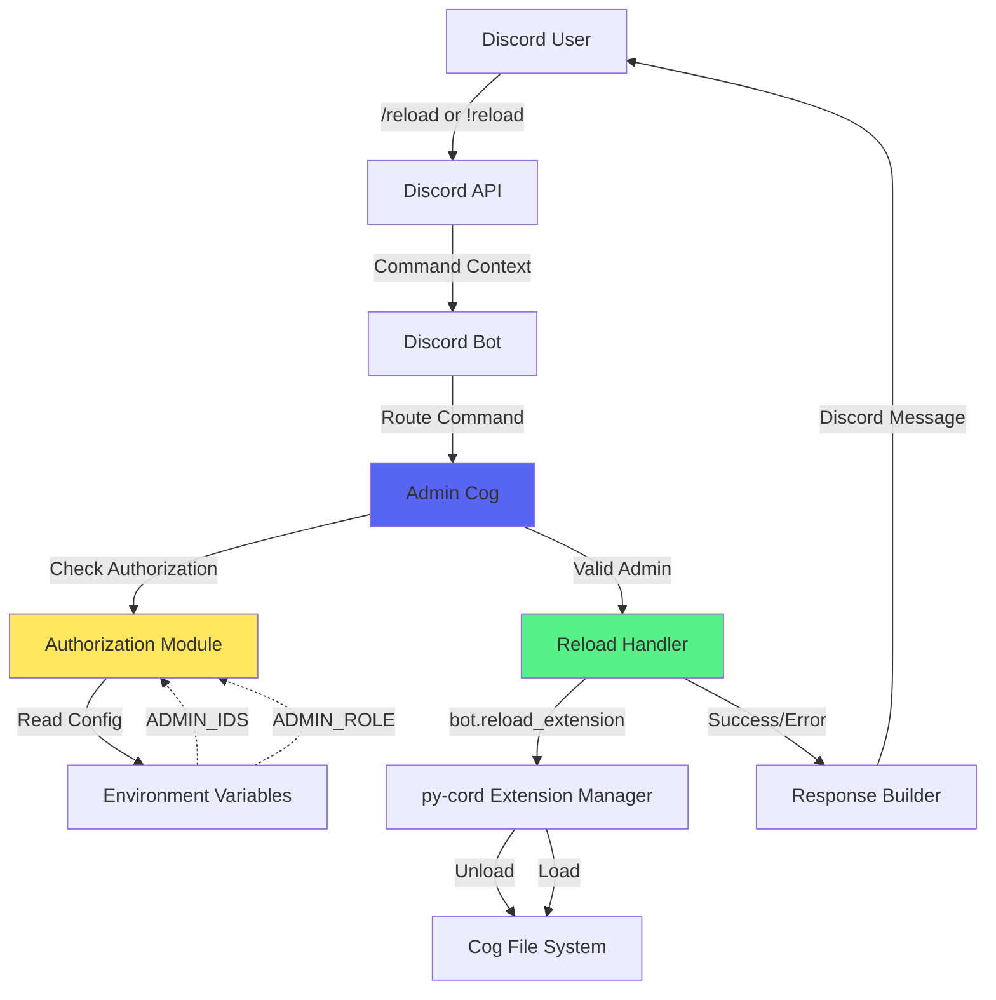
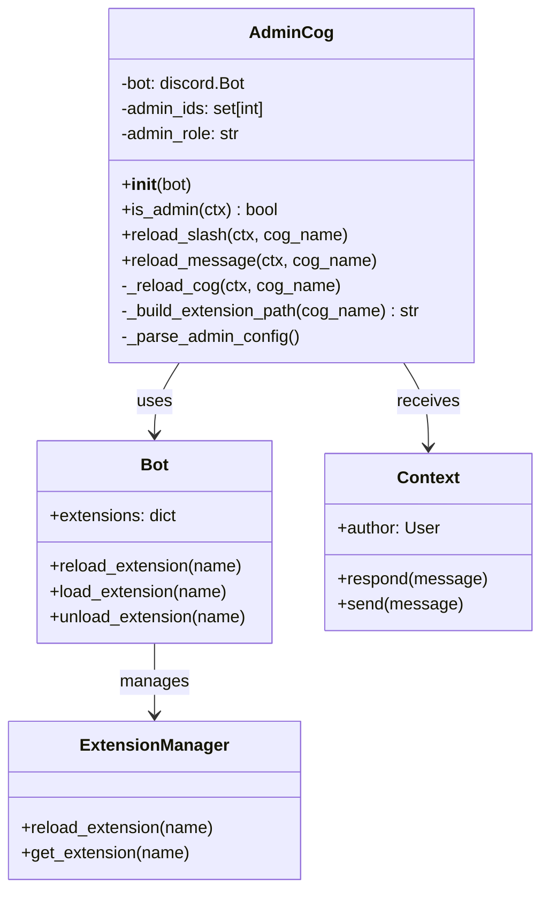

# Design Document: Cog Reload Feature

## Overview

The Cog Reload feature enables bot administrators to dynamically reload Discord bot Cog modules without restarting the entire bot process. This accelerates the development and debugging workflow by allowing code changes to take effect immediately.

**Core Functionality:**
- Admin-only command interface (slash and message commands)
- Authorization via environment variable configuration
- py-cord `bot.reload_extension()` integration
- Comprehensive error handling and user feedback

**Integration Points:**
- Existing py-cord bot structure in `main.py`
- Existing Cogs architecture (`cogs/` directory)
- Environment variables via `dotenv`
- Discord command contexts (slash and message)

## Architecture

### High-Level System Design



### Component Diagram



### Data Flow

**Successful Reload Flow:**
```
User -> /reload general
  -> AdminCog.reload_slash(ctx, "general")
    -> is_admin(ctx) → True
    -> _build_extension_path("general") → "cogs.general"
    -> bot.reload_extension("cogs.general")
      -> bot.unload_extension("cogs.general")
      -> bot.load_extension("cogs.general")
    -> ctx.respond("✅ general 리로드 성공!")
```

**Authorization Failure Flow:**
```
User (unauthorized) -> /reload general
  -> AdminCog.reload_slash(ctx, "general")
    -> is_admin(ctx) → False
    -> ctx.respond("❌ 권한이 없습니다.", ephemeral=True)
```

**Reload Error Flow:**
```
User -> /reload invalid_cog
  -> AdminCog.reload_slash(ctx, "invalid_cog")
    -> is_admin(ctx) → True
    -> _build_extension_path("invalid_cog") → "cogs.invalid_cog"
    -> bot.reload_extension("cogs.invalid_cog")
      -> raises discord.ExtensionNotLoaded
    -> ctx.respond("❌ 존재하지 않는 Cog입니다: invalid_cog")
```

## Components and Interfaces

### 1. Admin Cog Module (`cogs/admin.py`)

**Purpose:** Encapsulates all admin functionality including cog reload commands.

**Class Definition:**
```python
class Admin(commands.Cog):
    """
    Admin commands for bot management.
    Provides cog reload functionality with authorization.
    """
    
    def __init__(self, bot: discord.Bot):
        """
        Initialize Admin cog with bot instance and load configuration.
        
        Args:
            bot: The discord.Bot instance
        """
        self.bot = bot
        self.admin_ids: set[int] = set()
        self.admin_role: str | None = None
        self._parse_admin_config()
    
    def _parse_admin_config(self) -> None:
        """
        Parse admin authorization from environment variables.
        Populates self.admin_ids and self.admin_role.
        """
        pass
    
    async def is_admin(self, ctx: discord.ApplicationContext | commands.Context) -> bool:
        """
        Check if the command invoker is authorized as an admin.
        
        Args:
            ctx: Command context (slash or message command)
            
        Returns:
            True if user is authorized, False otherwise
        """
        pass
    
    @discord.slash_command(name="reload", description="Cog를 다시 로드합니다 (관리자 전용)")
    async def reload_slash(
        self, 
        ctx: discord.ApplicationContext,
        cog_name: str = discord.Option(description="리로드할 Cog 이름 (예: general)")
    ):
        """Slash command interface for cog reload."""
        pass
    
    @commands.command(name="reload")
    async def reload_message(self, ctx: commands.Context, cog_name: str):
        """Message command interface for cog reload."""
        pass
    
    async def _reload_cog(
        self, 
        ctx: discord.ApplicationContext | commands.Context, 
        cog_name: str
    ) -> None:
        """
        Core reload logic shared by both command interfaces.
        
        Args:
            ctx: Command context
            cog_name: Name of the cog to reload (without .py extension)
        """
        pass
    
    @staticmethod
    def _build_extension_path(cog_name: str) -> str:
        """
        Build the full extension path from cog name.
        
        Args:
            cog_name: Base cog name (e.g., "general")
            
        Returns:
            Full extension path (e.g., "cogs.general")
        """
        return f"cogs.{cog_name}"


def setup(bot: discord.Bot):
    """
    Setup function required by py-cord for cog loading.
    
    Args:
        bot: The discord.Bot instance
    """
    bot.add_cog(Admin(bot))
```

### 2. Authorization Module

**Implementation:** Integrated within Admin cog as methods.

**Authorization Strategy:**
- **User ID-based:** Check if `ctx.author.id` is in `ADMIN_IDS` environment variable
- **Role-based:** Check if user has role matching `ADMIN_ROLE` environment variable
- **Logical OR:** User is admin if either condition is true

**Environment Variable Format:**
- `ADMIN_IDS`: Comma-separated Discord user IDs (e.g., "123456789,987654321")
- `ADMIN_ROLE`: Single role name (e.g., "!")

**Authorization Logic:**
```python
async def is_admin(self, ctx) -> bool:
    author_id = ctx.author.id
    
    # Check user ID authorization
    if author_id in self.admin_ids:
        return True
    
    # Check role authorization (only for guild contexts)
    if self.admin_role and hasattr(ctx.author, "roles"):
        user_role_names = [role.name for role in ctx.author.roles]
        if self.admin_role in user_role_names:
            return True
    
    return False
```

### 3. Reload Handler

**Implementation:** Core method `_reload_cog()` within Admin cog.

**Algorithm:**
```
1. Authorize user via is_admin()
   - If unauthorized: respond with error, return
   
2. Build extension path
   - extension_path = f"cogs.{cog_name}"
   
3. Attempt reload
   - Call bot.reload_extension(extension_path)
   - Handle exceptions:
     - ExtensionNotLoaded: Cog doesn't exist
     - ExtensionFailed: Syntax/import error in cog file
     - Exception: Unexpected error
   
4. Build response
   - Success: "✅ {cog_name} 리로드 성공!"
   - Error: Specific error message
   
5. Send response to user
```

**Error Handling Matrix:**

| Exception Type | User Message | Behavior |
|---|---|---|
| `discord.ExtensionNotLoaded` | "❌ 존재하지 않는 Cog입니다: {cog_name}" | List available cogs |
| `discord.ExtensionFailed` | "❌ 리로드 중 오류 발생:\n```{error}```" | Show traceback |
| `ModuleNotFoundError` | "❌ Cog 파일을 찾을 수 없습니다: {cog_name}" | - |
| `SyntaxError` | "❌ 문법 오류:\n```{error}```" | Show line number |
| `Exception` | "❌ 예기치 않은 오류:\n```{error}```" | Full error details |

### 4. Response Builder

**Implementation:** Response formatting within `_reload_cog()`.

**Response Types:**
- **Success:** Embed with green color, success icon, cog name
- **Authorization Error:** Ephemeral message (only visible to user)
- **Validation Error:** Public error message with helpful context
- **Reload Error:** Code block with error details for debugging

**Response Format Examples:**
```python
# Success
await ctx.respond("✅ general 리로드 성공!")

# Authorization failure (ephemeral)
await ctx.respond("❌ 권한이 없습니다.", ephemeral=True)

# Cog not found
await ctx.respond(
    f"❌ 존재하지 않는 Cog입니다: {cog_name}\n"
    f"사용 가능한 Cogs: {', '.join(available_cogs)}"
)

# Reload error with details
await ctx.respond(
    f"❌ 리로드 중 오류 발생:\n```python\n{error_details}\n```"
)
```

## Data Models

### Configuration Data

**Source:** Environment variables loaded via `python-dotenv`

**Schema:**
```python
@dataclass
class AdminConfig:
    """Admin authorization configuration."""
    admin_ids: set[int]      # Set of authorized Discord user IDs
    admin_role: str | None   # Optional role name for authorization
```

**Parsing Logic:**
```python
def _parse_admin_config(self) -> None:
    """Parse environment variables into configuration."""
    # Parse ADMIN_IDS
    admin_ids_str = os.getenv("ADMIN_IDS", "")
    if admin_ids_str:
        try:
            self.admin_ids = {
                int(id_str.strip()) 
                for id_str in admin_ids_str.split(",") 
                if id_str.strip()
            }
        except ValueError as e:
            print(f"⚠️ ADMIN_IDS 파싱 오류: {e}")
            self.admin_ids = set()
    else:
        print("⚠️ ADMIN_IDS 환경 변수가 설정되지 않았습니다.")
        self.admin_ids = set()
    
    # Parse ADMIN_ROLE
    self.admin_role = os.getenv("ADMIN_ROLE", None)
    if not self.admin_role:
        print("⚠️ ADMIN_ROLE 환경 변수가 설정되지 않았습니다.")
```

### Command Context Data

**py-cord Types:**
- `discord.ApplicationContext`: Slash command context
- `commands.Context`: Message command context

**Relevant Attributes:**
```python
# Common to both context types
ctx.author: discord.User | discord.Member
ctx.author.id: int
ctx.author.roles: list[discord.Role]  # Only in guild context

# Response methods
await ctx.respond(content: str, ephemeral: bool = False)
await ctx.send(content: str)
```

### Extension State

**py-cord Internal State:**
```python
bot.extensions: dict[str, types.ModuleType]
# Key: Extension path (e.g., "cogs.general")
# Value: Loaded module object
```

**Extension Operations:**
```python
# Check if extension is loaded
extension_path in bot.extensions

# Get loaded extension names
loaded_cog_names = [
    ext.split(".")[-1] 
    for ext in bot.extensions.keys() 
    if ext.startswith("cogs.")
]
```

## Error Handling

### Error Categories

1. **Authorization Errors**
   - User not in ADMIN_IDS
   - User doesn't have ADMIN_ROLE
   - **Response:** "❌ 권한이 없습니다." (ephemeral)
   - **Action:** Early return, no reload attempt

2. **Validation Errors**
   - Cog name not found in loaded extensions
   - Empty cog name parameter
   - **Response:** Error message with list of available cogs
   - **Action:** No reload attempt

3. **Reload Errors - Syntax/Import**
   - Python syntax error in cog file
   - Import error (missing dependency)
   - **Response:** Full error traceback in code block
   - **Action:** Previous cog version remains loaded

4. **Reload Errors - Runtime**
   - Exception in cog's `__init__`
   - Exception in cog's `setup()` function
   - **Response:** Error details with function name
   - **Action:** Extension may be partially loaded

5. **Unexpected Errors**
   - File system errors
   - Permission errors
   - Discord API errors
   - **Response:** Generic error message with details
   - **Action:** Log error, inform user

### Error Recovery Strategy

**Principle:** Preserve bot stability above all else.

**Implementation:**
```python
async def _reload_cog(self, ctx, cog_name: str) -> None:
    if not await self.is_admin(ctx):
        return await ctx.respond("❌ 권한이 없습니다.", ephemeral=True)
    
    extension_path = self._build_extension_path(cog_name)
    
    # Check if extension exists before attempting reload
    if extension_path not in self.bot.extensions:
        available = [ext.split(".")[-1] for ext in self.bot.extensions.keys() if ext.startswith("cogs.")]
        return await ctx.respond(
            f"❌ 존재하지 않는 Cog입니다: {cog_name}\n"
            f"사용 가능한 Cogs: {', '.join(available)}"
        )
    
    try:
        # py-cord handles unload + load internally
        self.bot.reload_extension(extension_path)
        await ctx.respond(f"✅ {cog_name} 리로드 성공!")
        
    except discord.ExtensionFailed as e:
        # Syntax error, import error, or exception in setup()
        await ctx.respond(
            f"❌ 리로드 중 오류 발생:\n```python\n{e}\n```"
        )
    
    except discord.ExtensionNotLoaded as e:
        # Should not happen due to pre-check, but handle defensively
        await ctx.respond(f"❌ {cog_name}이(가) 로드되지 않았습니다.")
    
    except Exception as e:
        # Catch-all for unexpected errors
        await ctx.respond(
            f"❌ 예기치 않은 오류:\n```python\n{type(e).__name__}: {e}\n```"
        )
```

### Logging Strategy

**Log Levels:**
- **INFO:** Successful reloads, admin command usage
- **WARNING:** Authorization failures, missing configuration
- **ERROR:** Reload failures, unexpected exceptions

**Implementation:**
```python
import logging

logger = logging.getLogger(__name__)

# In __init__
logger.info(f"Admin cog initialized with {len(self.admin_ids)} authorized IDs")

# In is_admin
logger.warning(f"Unauthorized reload attempt by {ctx.author.id}")

# In _reload_cog
logger.info(f"Reloading cog: {cog_name} by {ctx.author.id}")
logger.error(f"Failed to reload {cog_name}: {error}")
```

## Testing Strategy

### Overview

This feature is primarily tested through **unit tests** and **integration tests**, as it involves Discord bot command handling, external API interactions, and side effects (loading/unloading extensions). Property-based testing is not appropriate here because:

- The feature tests Discord bot command handling, not pure functions
- It involves side effects and Discord API interactions
- The behavior doesn't vary meaningfully across a wide input space
- Testing requires mocking Discord internals and bot lifecycle operations

### Unit Testing Approach

**Testing Framework:** `pytest` with `pytest-asyncio` for async support

**Mock Strategy:** Use `unittest.mock` to mock Discord objects

**Test Scope:** Individual methods in isolation

**Test Cases:**

1. **Authorization Tests**
   ```python
   # Test: User with valid ID is authorized
   # Given: User ID in ADMIN_IDS
   # When: is_admin() is called
   # Then: Returns True
   
   # Test: User with valid role is authorized
   # Given: User has ADMIN_ROLE
   # When: is_admin() is called
   # Then: Returns True
   
   # Test: User without authorization is rejected
   # Given: User ID not in ADMIN_IDS and no ADMIN_ROLE
   # When: is_admin() is called
   # Then: Returns False
   
   # Test: Empty configuration logs warning
   # Given: ADMIN_IDS and ADMIN_ROLE are empty
   # When: _parse_admin_config() is called
   # Then: Logs warning messages
   ```

2. **Configuration Parsing Tests**
   ```python
   # Test: Valid ADMIN_IDS parsed correctly
   # Given: ADMIN_IDS = "123,456,789"
   # When: _parse_admin_config() is called
   # Then: admin_ids = {123, 456, 789}
   
   # Test: Invalid ADMIN_IDS handled gracefully
   # Given: ADMIN_IDS = "123,abc,789"
   # When: _parse_admin_config() is called
   # Then: Logs error, admin_ids = set()
   
   # Test: Whitespace in ADMIN_IDS handled
   # Given: ADMIN_IDS = "123, 456 , 789 "
   # When: _parse_admin_config() is called
   # Then: admin_ids = {123, 456, 789}
   ```

3. **Extension Path Building Tests**
   ```python
   # Test: Valid cog name builds correct path
   # Given: cog_name = "general"
   # When: _build_extension_path() is called
   # Then: Returns "cogs.general"
   
   # Test: Cog name with special characters
   # Given: cog_name = "test_cog"
   # When: _build_extension_path() is called
   # Then: Returns "cogs.test_cog"
   ```

4. **Error Handling Tests**
   ```python
   # Test: ExtensionNotLoaded error handled
   # Given: Cog not in bot.extensions
   # When: _reload_cog() is called
   # Then: Responds with "존재하지 않는 Cog입니다"
   
   # Test: ExtensionFailed error handled
   # Given: bot.reload_extension() raises ExtensionFailed
   # When: _reload_cog() is called
   # Then: Responds with error details in code block
   
   # Test: Generic exception handled
   # Given: bot.reload_extension() raises unexpected Exception
   # When: _reload_cog() is called
   # Then: Responds with "예기치 않은 오류"
   ```

### Integration Testing Approach

**Test Environment:** Real Discord bot instance with test cogs

**Test Scope:** Full command flow from invocation to response

**Test Cases:**

1. **Successful Reload Integration Test**
   ```python
   # Setup: Create test cog file with simple command
   # Given: Admin user invokes /reload test_cog
   # When: Command is processed
   # Then: 
   #   - test_cog is unloaded
   #   - test_cog is reloaded
   #   - Response is "✅ test_cog 리로드 성공!"
   ```

2. **Authorization Integration Test**
   ```python
   # Setup: Configure ADMIN_IDS with test user
   # Given: Non-admin user invokes /reload general
   # When: Command is processed
   # Then: Response is "❌ 권한이 없습니다." (ephemeral)
   ```

3. **Syntax Error Integration Test**
   ```python
   # Setup: Create test cog with syntax error
   # Given: Admin invokes /reload broken_cog
   # When: Command is processed
   # Then: 
   #   - Response contains "문법 오류" or "리로드 중 오류 발생"
   #   - Original cog remains loaded (if was loaded)
   ```

4. **Message Command Integration Test**
   ```python
   # Given: Admin sends "!reload general"
   # When: Message command is processed
   # Then: Same behavior as slash command
   ```

### Test Data

**Mock Discord Objects:**
```python
@pytest.fixture
def mock_bot():
    bot = MagicMock(spec=discord.Bot)
    bot.extensions = {
        "cogs.general": MagicMock(),
        "cogs.admin": MagicMock(),
        "cogs.event_listener": MagicMock()
    }
    return bot

@pytest.fixture
def mock_admin_context():
    ctx = MagicMock(spec=discord.ApplicationContext)
    ctx.author.id = 123456789  # Admin ID
    ctx.author.roles = []
    ctx.respond = AsyncMock()
    return ctx

@pytest.fixture
def mock_user_context():
    ctx = MagicMock(spec=discord.ApplicationContext)
    ctx.author.id = 999999999  # Non-admin ID
    ctx.author.roles = []
    ctx.respond = AsyncMock()
    return ctx
```

**Test Cog File:**
```python
# tests/fixtures/test_cog.py
import discord
from discord.ext import commands

class TestCog(commands.Cog):
    def __init__(self, bot):
        self.bot = bot
        self.reload_count = 0

def setup(bot):
    bot.add_cog(TestCog(bot))
```

### Edge Cases

1. **Self-reload:** Admin cog reloading itself
   - Test that the reload command still responds after reload
   
2. **Concurrent reloads:** Multiple reload commands at once
   - Test thread safety and response accuracy

3. **Missing dependencies:** Cog imports missing module
   - Test error message clarity

4. **Circular imports:** Cog causes import loop
   - Test that bot doesn't crash

5. **Empty cog name:** User provides empty string
   - Test validation and helpful error message

### Test Execution

**Command:**
```bash
pytest tests/test_admin_cog.py -v
```

**Coverage Target:** >85% code coverage for Admin cog

**CI Integration:** Run tests on every commit to main branch

