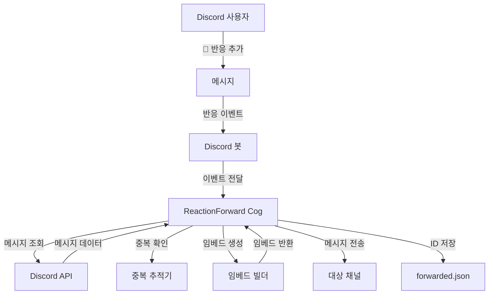
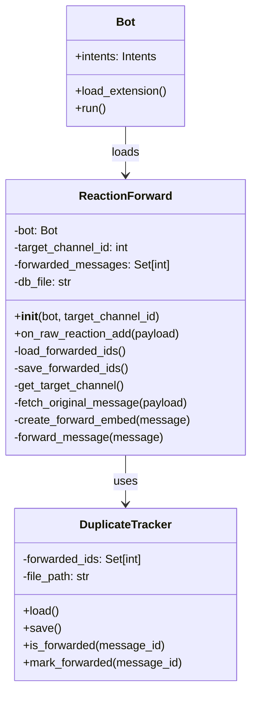
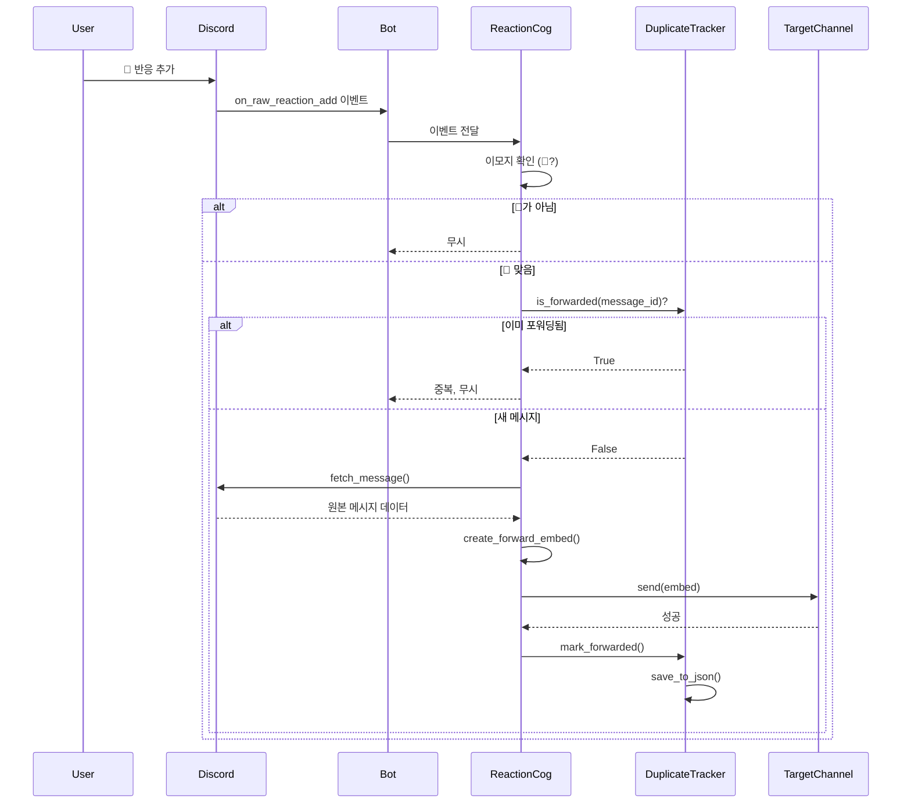

# 디자인 문서 - 반응 기반 메시지 포워딩 기능

## 개요

이 문서는 Discord 봇에 📌 이모지 반응을 감지하여 메시지를 자동으로 지정된 채널에 포워딩하는 기능의 상세 설계를 정의합니다.

### 목적

사용자가 중요한 메시지에 📌 반응을 추가하면, 봇이 자동으로 해당 메시지를 지정된 "고정 메시지" 채널로 포워딩하여 중요한 정보를 한 곳에 모읍니다.

### 범위

- 📌 이모지 반응 감지 (오래된 메시지 포함)
- 메시지 정보 추출 및 포맷팅
- 임베드 형식으로 대상 채널에 포워딩
- 중복 전송 방지
- 오류 처리 및 로깅
- 기존 py-cord 기반 cog 구조 통합

### 핵심 원칙

1. **비침해성**: 원본 메시지를 수정하거나 삭제하지 않음
2. **멱등성**: 동일한 메시지를 여러 번 반응해도 한 번만 포워딩
3. **강건성**: 개별 포워딩 실패가 전체 시스템에 영향을 주지 않음
4. **확장성**: 향후 다른 이모지나 기능 추가가 용이한 구조

## 아키텍처

### 시스템 개요



### 컴포넌트 다이어그램



### 실행 흐름



## 컴포넌트 및 인터페이스

### 1. ReactionForward Cog

**책임**: 반응 이벤트를 감지하고 메시지 포워딩을 조율하는 메인 컴포넌트

```python
class ReactionForward(commands.Cog):
    """
    📌 반응 시 메시지를 지정된 채널로 포워딩하는 Cog
    """

    def __init__(self, bot: discord.Bot, target_channel_id: int = None):
        """
        Cog 초기화

        Args:
            bot: Discord 봇 인스턴스
            target_channel_id: 포워딩 대상 채널 ID (기본값: 설정 필요)
        """
        pass

    @commands.Cog.listener()
    async def on_raw_reaction_add(self, payload: discord.RawReactionActionEvent):
        """
        모든 반응 추가 이벤트를 감지 (캐시되지 않은 메시지 포함)

        Args:
            payload: 반응 이벤트 페이로드
        """
        pass

    async def _get_target_channel(self) -> Optional[discord.TextChannel]:
        """대상 채널 객체를 가져옴"""
        pass

    async def _fetch_original_message(
        self,
        payload: discord.RawReactionActionEvent
    ) -> Optional[discord.Message]:
        """원본 메시지를 API로부터 가져옴"""
        pass

    def _create_forward_embed(self, message: discord.Message) -> discord.Embed:
        """포워딩할 임베드를 생성"""
        pass

    async def _forward_message(self, message: discord.Message):
        """메시지를 대상 채널로 포워딩하는 메인 로직"""
        pass
```

### 2. DuplicateTracker (내장 모듈)

**책임**: 포워딩된 메시지 ID를 추적하여 중복 방지

ReactionForward Cog 내에 메서드로 통합됩니다:

```python
# ReactionForward 클래스 내부 메서드들:

def _load_forwarded_ids(self) -> Set[int]:
    """
    JSON 파일에서 이미 포워딩된 메시지 ID 목록을 로드

    Returns:
        Set[int]: 포워딩된 메시지 ID 집합
    """
    pass

def _save_forwarded_ids(self):
    """
    현재 포워딩된 메시지 ID 목록을 JSON 파일에 저장
    """
    pass

def _is_forwarded(self, message_id: int) -> bool:
    """
    메시지가 이미 포워딩되었는지 확인

    Args:
        message_id: 확인할 메시지 ID

    Returns:
        bool: 이미 포워딩된 경우 True
    """
    pass

def _mark_forwarded(self, message_id: int):
    """
    메시지를 포워딩됨으로 표시하고 저장

    Args:
        message_id: 표시할 메시지 ID
    """
    pass
```

### 3. 임베드 생성 로직

**책임**: 원본 메시지로부터 포맷된 Discord 임베드 생성

임베드 구조:

- **작성자**: 원본 메시지 작성자의 이름과 아바타
- **설명**: 원본 메시지의 텍스트 콘텐츠
- **이미지**: 첫 번째 첨부 이미지 (있는 경우)
- **필드**: 원본 메시지로 이동하는 링크
- **색상**: 시각적 일관성을 위한 브랜드 컬러
- **타임스탬프**: 원본 메시지 생성 시간

```python
def _create_forward_embed(self, message: discord.Message) -> discord.Embed:
    """
    포워딩할 임베드를 생성

    임베드 구성:
    - author: 원본 작성자 이름 + 아바타
    - description: 메시지 텍스트 (최대 2048자)
    - image: 첫 번째 이미지 첨부 (있을 경우)
    - field: 원본 메시지 링크
    - color: 0x5865F2 (Discord 블루)
    - timestamp: 원본 메시지 생성 시간
    """
    embed = discord.Embed(
        description=message.content or "*첨부 파일만 포함*",
        color=0x5865F2,
        timestamp=message.created_at
    )

    embed.set_author(
        name=message.author.display_name,
        icon_url=message.author.display_avatar.url
    )

    # 첫 번째 이미지 첨부
    if message.attachments:
        for attachment in message.attachments:
            if attachment.content_type and attachment.content_type.startswith("image/"):
                embed.set_image(url=attachment.url)
                break

    # 원본 메시지 링크
    embed.add_field(
        name="📌 원본 메시지",
        value=f"[여기를 클릭하세요]({message.jump_url})",
        inline=False
    )

    return embed
```

## 데이터 모델

### 1. 중복 추적 데이터 (forwarded.json)

**파일 경로**: `./forwarded.json` (봇 실행 디렉토리 기준)

**형식**: JSON 배열

```json
{
  "forwarded_message_ids": [
    1234567890123456789, 9876543210987654321, 1111222233334444555
  ]
}
```

**필드 설명**:

- `forwarded_message_ids`: 이미 포워딩된 메시지 ID의 배열 (정수 배열)

**접근 패턴**:

- **읽기**: Cog 초기화 시 1회
- **쓰기**: 메시지 포워딩 성공 후 즉시
- **조회**: 반응 감지 시마다 (메모리 Set에서)

### 2. 구성 데이터

**저장 위치**: 코드 내 상수 또는 환경 변수

```python
# 기본 설정
DEFAULT_TARGET_CHANNEL_ID = None  # 설정 필수
PIN_EMOJI = "📌"
FORWARDED_DB_FILE = "forwarded.json"
EMBED_COLOR = 0x5865F2  # Discord 블루
```

향후 확장을 위한 구성 예시:

```python
# config.json (선택적)
{
  "reaction_forward": {
    "target_channel_id": 1234567890123456789,
    "pin_emoji": "📌",
    "db_file": "forwarded.json",
    "max_embed_length": 2048
  }
}
```

### 3. Discord 데이터 모델

이 기능에서 사용하는 주요 Discord.py 객체:

```python
# RawReactionActionEvent
class RawReactionActionEvent:
    message_id: int           # 반응이 추가된 메시지 ID
    user_id: int              # 반응을 추가한 유저 ID
    channel_id: int           # 메시지가 있는 채널 ID
    guild_id: Optional[int]   # 서버 ID (DM인 경우 None)
    emoji: PartialEmoji       # 추가된 이모지
    member: Optional[Member]  # 반응한 멤버 (서버에서만)

# Message
class Message:
    id: int                   # 메시지 ID
    content: str              # 메시지 텍스트
    author: User/Member       # 작성자
    created_at: datetime      # 생성 시간
    jump_url: str             # 메시지로 이동하는 URL
    attachments: List[Attachment]  # 첨부 파일 목록
    channel: TextChannel      # 메시지가 있는 채널
    guild: Optional[Guild]    # 서버 (DM인 경우 None)

# Embed
class Embed:
    title: Optional[str]
    description: Optional[str]
    color: Optional[int]
    timestamp: Optional[datetime]
    author: Optional[EmbedAuthor]
    fields: List[EmbedField]
    image: Optional[EmbedMedia]
```

## 오류 처리

### 오류 처리 전략

1. **비침해적 실패**: 개별 포워딩 실패가 전체 봇 작동에 영향을 주지 않음
2. **로깅 우선**: 모든 오류를 로그에 기록하여 디버깅 가능하게 함
3. **자동 복구**: 재시작 후 중복 추적 데이터를 로드하여 상태 복구

### 오류 시나리오 및 대응

| 오류 시나리오             | 원인                          | 대응 방법                    | 영향                                          |
| ------------------------- | ----------------------------- | ---------------------------- | --------------------------------------------- |
| **대상 채널 없음**        | 잘못된 채널 ID, 채널 삭제됨   | 로그 기록 후 계속 진행       | 해당 메시지만 포워딩 실패                     |
| **채널 접근 권한 없음**   | 봇이 채널 조회/쓰기 권한 없음 | 로그 기록 후 계속 진행       | 해당 메시지만 포워딩 실패                     |
| **원본 메시지 조회 실패** | 메시지 삭제됨, 채널 권한 없음 | 로그 기록 후 계속 진행       | 해당 메시지만 포워딩 실패                     |
| **메시지 전송 실패**      | 네트워크 오류, 권한 오류      | 로그 기록 후 계속 진행       | 해당 메시지만 포워딩 실패, ID는 저장하지 않음 |
| **JSON 파일 읽기 실패**   | 파일 손상, 권한 없음          | 빈 Set으로 초기화, 로그 기록 | 중복 방지 기능 일시 중단 (재포워딩 가능)      |
| **JSON 파일 쓰기 실패**   | 디스크 공간 부족, 권한 없음   | 로그 기록, 메모리에는 유지   | 재시작 시 해당 ID 손실 (재포워딩 가능)        |
| **봇 자신의 반응**        | 봇이 📌 반응 추가             | user_id 체크로 무시          | 영향 없음                                     |

### 오류 처리 구현 예시

```python
async def on_raw_reaction_add(self, payload: discord.RawReactionActionEvent):
    """반응 추가 이벤트 핸들러 - 모든 예외를 포착하여 로깅"""
    try:
        # 봇 자신의 반응 무시
        if payload.user_id == self.bot.user.id:
            return

        # 📌 이모지가 아니면 무시
        if str(payload.emoji) != "📌":
            return

        # 중복 확인
        if self._is_forwarded(payload.message_id):
            print(f"ℹ️ 메시지 {payload.message_id}는 이미 포워딩됨. 무시.")
            return

        # 메시지 포워딩 시도
        await self._forward_message_safe(payload)

    except Exception as e:
        # 최상위 예외 핸들러 - 절대 크래시하지 않음
        print(f"❌ on_raw_reaction_add 예외: {e}")
        import traceback
        traceback.print_exc()

async def _forward_message_safe(self, payload: discord.RawReactionActionEvent):
    """안전한 메시지 포워딩 (개별 오류 처리)"""
    try:
        # 1. 대상 채널 가져오기
        target_channel = await self._get_target_channel()
        if not target_channel:
            print(f"❌ 대상 채널 {self.target_channel_id}를 찾을 수 없음")
            return

        # 2. 원본 메시지 가져오기
        original_message = await self._fetch_original_message(payload)
        if not original_message:
            print(f"❌ 메시지 {payload.message_id}를 가져올 수 없음")
            return

        # 3. 임베드 생성
        embed = self._create_forward_embed(original_message)

        # 4. 메시지 전송
        await target_channel.send(embed=embed)
        print(f"✅ 메시지 {payload.message_id} 포워딩 완료")

        # 5. 중복 방지 표시
        self._mark_forwarded(payload.message_id)

    except discord.Forbidden:
        print(f"❌ 권한 없음: 채널 {self.target_channel_id}에 접근/쓰기 불가")
    except discord.NotFound:
        print(f"❌ 찾을 수 없음: 메시지 또는 채널이 삭제됨")
    except discord.HTTPException as e:
        print(f"❌ Discord API 오류: {e}")
    except Exception as e:
        print(f"❌ 포워딩 중 예외: {e}")
```

## 테스트 전략

이 기능은 Discord API와의 통합, 이벤트 리스너, 그리고 부수 효과(메시지 전송)에 중점을 두므로, **속성 기반 테스트(Property-Based Testing)는 적용하지 않습니다**. 대신 **예제 기반 단위 테스트**와 **통합 테스트**를 사용합니다.

### 테스트 범위

| 테스트 유형     | 범위             | 도구                              | 목적                    |
| --------------- | ---------------- | --------------------------------- | ----------------------- |
| **단위 테스트** | 개별 메서드 로직 | pytest + pytest-asyncio           | 비즈니스 로직 검증      |
| **통합 테스트** | Discord API 통합 | pytest + discord.py test fixtures | 실제 Discord 동작 검증  |
| **모의 테스트** | 외부 의존성 격리 | unittest.mock                     | API 호출 없이 로직 검증 |

### 1. 단위 테스트

**테스트 대상 메서드**:

- `_is_forwarded()`: 중복 확인 로직
- `_mark_forwarded()`: ID 저장 로직
- `_create_forward_embed()`: 임베드 생성 로직
- `_load_forwarded_ids()`: JSON 로드
- `_save_forwarded_ids()`: JSON 저장

**테스트 케이스 예시**:

```python
import pytest
from unittest.mock import Mock, AsyncMock, patch
from cogs.reaction_forward import ReactionForward

@pytest.fixture
def cog():
    bot = Mock()
    bot.user.id = 999
    return ReactionForward(bot, target_channel_id=123456)

def test_is_forwarded_returns_true_for_existing_id(cog):
    """이미 포워딩된 메시지 ID는 True 반환"""
    cog.forwarded_messages.add(12345)
    assert cog._is_forwarded(12345) is True

def test_is_forwarded_returns_false_for_new_id(cog):
    """새로운 메시지 ID는 False 반환"""
    assert cog._is_forwarded(99999) is False

def test_mark_forwarded_adds_id_to_set(cog):
    """mark_forwarded는 ID를 Set에 추가"""
    cog._mark_forwarded(54321)
    assert 54321 in cog.forwarded_messages

def test_create_embed_includes_author_info():
    """임베드에 작성자 정보가 포함됨"""
    message = Mock()
    message.author.display_name = "테스트유저"
    message.author.display_avatar.url = "https://example.com/avatar.png"
    message.content = "테스트 메시지"
    message.created_at = datetime.now()
    message.jump_url = "https://discord.com/channels/..."
    message.attachments = []

    cog = ReactionForward(Mock(), target_channel_id=123)
    embed = cog._create_forward_embed(message)

    assert embed.author.name == "테스트유저"
    assert embed.author.icon_url == "https://example.com/avatar.png"
    assert "테스트 메시지" in embed.description
```

### 2. 통합 테스트 (모의 객체 사용)

**테스트 대상**: 전체 포워딩 흐름 (이벤트 → 메시지 전송)

```python
@pytest.mark.asyncio
async def test_on_reaction_add_forwards_new_message():
    """새 메시지에 📌 반응 시 포워딩됨"""
    bot = Mock()
    bot.user.id = 999

    cog = ReactionForward(bot, target_channel_id=123456)

    # 모의 페이로드
    payload = Mock()
    payload.user_id = 111
    payload.emoji = Mock()
    payload.emoji.__str__ = lambda self: "📌"
    payload.message_id = 777777
    payload.channel_id = 888888

    # 모의 채널 및 메시지
    mock_channel = AsyncMock()
    mock_message = Mock()
    mock_message.author.display_name = "유저1"
    mock_message.author.display_avatar.url = "http://example.com/avatar.png"
    mock_message.content = "중요한 메시지"
    mock_message.created_at = datetime.now()
    mock_message.jump_url = "https://discord.com/channels/1/2/777777"
    mock_message.attachments = []

    with patch.object(cog, '_get_target_channel', return_value=mock_channel):
        with patch.object(cog, '_fetch_original_message', return_value=mock_message):
            await cog.on_raw_reaction_add(payload)

    # 검증
    assert mock_channel.send.called
    assert cog._is_forwarded(777777)

@pytest.mark.asyncio
async def test_on_reaction_add_ignores_duplicate():
    """이미 포워딩된 메시지는 무시됨"""
    bot = Mock()
    bot.user.id = 999

    cog = ReactionForward(bot, target_channel_id=123456)
    cog.forwarded_messages.add(777777)  # 이미 포워딩됨

    payload = Mock()
    payload.user_id = 111
    payload.emoji = Mock()
    payload.emoji.__str__ = lambda self: "📌"
    payload.message_id = 777777

    mock_channel = AsyncMock()

    with patch.object(cog, '_get_target_channel', return_value=mock_channel):
        await cog.on_raw_reaction_add(payload)

    # 검증: 메시지 전송되지 않음
    assert not mock_channel.send.called

@pytest.mark.asyncio
async def test_on_reaction_add_ignores_non_pin_emoji():
    """📌가 아닌 이모지는 무시됨"""
    bot = Mock()
    bot.user.id = 999

    cog = ReactionForward(bot, target_channel_id=123456)

    payload = Mock()
    payload.user_id = 111
    payload.emoji = Mock()
    payload.emoji.__str__ = lambda self: "👍"  # 다른 이모지
    payload.message_id = 777777

    mock_channel = AsyncMock()

    with patch.object(cog, '_get_target_channel', return_value=mock_channel):
        await cog.on_raw_reaction_add(payload)

    # 검증: 메시지 전송되지 않음
    assert not mock_channel.send.called
```

### 3. 엣지 케이스 테스트

```python
def test_create_embed_handles_empty_content():
    """메시지 내용이 없을 때 기본 텍스트 표시"""
    message = Mock()
    message.author.display_name = "유저"
    message.author.display_avatar.url = "http://example.com/avatar.png"
    message.content = ""  # 빈 내용
    message.created_at = datetime.now()
    message.jump_url = "https://discord.com/channels/1/2/3"
    message.attachments = []

    cog = ReactionForward(Mock(), target_channel_id=123)
    embed = cog._create_forward_embed(message)

    assert "*첨부 파일만 포함*" in embed.description

def test_create_embed_includes_first_image_only():
    """여러 이미지 중 첫 번째만 포함"""
    message = Mock()
    message.author.display_name = "유저"
    message.author.display_avatar.url = "http://example.com/avatar.png"
    message.content = "이미지 여러 개"
    message.created_at = datetime.now()
    message.jump_url = "https://discord.com/channels/1/2/3"

    # 여러 이미지 첨부 파일
    attachment1 = Mock()
    attachment1.content_type = "image/png"
    attachment1.url = "https://example.com/image1.png"

    attachment2 = Mock()
    attachment2.content_type = "image/jpeg"
    attachment2.url = "https://example.com/image2.jpg"

    message.attachments = [attachment1, attachment2]

    cog = ReactionForward(Mock(), target_channel_id=123)
    embed = cog._create_forward_embed(message)

    # 첫 번째 이미지만 포함됨
    assert embed.image.url == "https://example.com/image1.png"

def test_load_forwarded_ids_handles_missing_file():
    """파일이 없을 때 빈 Set 반환"""
    cog = ReactionForward(Mock(), target_channel_id=123)
    cog.db_file = "nonexistent_file.json"

    forwarded_ids = cog._load_forwarded_ids()

    assert forwarded_ids == set()

@pytest.mark.asyncio
async def test_forward_handles_channel_not_found():
    """대상 채널이 없을 때 오류 로깅 후 계속 진행"""
    bot = Mock()
    bot.user.id = 999

    cog = ReactionForward(bot, target_channel_id=999999)

    payload = Mock()
    payload.user_id = 111
    payload.emoji = Mock()
    payload.emoji.__str__ = lambda self: "📌"
    payload.message_id = 777777

    with patch.object(cog, '_get_target_channel', return_value=None):
        # 예외가 발생하지 않아야 함
        await cog.on_raw_reaction_add(payload)

    # 메시지는 포워딩되지 않음
    assert not cog._is_forwarded(777777)
```

### 4. 수동 테스트 시나리오

실제 Discord 환경에서 수행할 수동 테스트:

| 시나리오          | 단계                                                       | 예상 결과                          |
| ----------------- | ---------------------------------------------------------- | ---------------------------------- |
| **정상 포워딩**   | 1. 메시지 작성2. 📌 반응 추가                              | 대상 채널에 임베드로 포워딩됨      |
| **중복 방지**     | 1. 메시지에 📌 반응 추가2. 동일 메시지에 다시 📌 반응 추가 | 첫 번째만 포워딩, 두 번째는 무시됨 |
| **이미지 포함**   | 1. 이미지가 첨부된 메시지 작성2. 📌 반응 추가              | 임베드에 이미지가 포함됨           |
| **오래된 메시지** | 1. 몇 주 전 메시지 찾기2. 📌 반응 추가                     | 정상적으로 포워딩됨                |
| **다른 이모지**   | 1. 메시지에 👍 반응 추가                                   | 아무 일도 일어나지 않음            |
| **권한 없음**     | 1. 봇이 접근할 수 없는 채널로 설정2. 📌 반응 추가          | 오류 로그 출력, 봇은 계속 작동     |
| **재시작 테스트** | 1. 메시지 포워딩2. 봇 재시작3. 동일 메시지에 📌 반응 추가  | 중복으로 감지되어 무시됨           |

### 5. 테스트 실행

```bash
# 단위 테스트 실행
pytest tests/test_reaction_forward.py -v

# 특정 테스트만 실행
pytest tests/test_reaction_forward.py::test_is_forwarded_returns_true -v

# 커버리지와 함께 실행
pytest tests/test_reaction_forward.py --cov=cogs.reaction_forward --cov-report=html
```

### 6. 테스트 요구사항

- **최소 코드 커버리지**: 80%
- **모든 공개 메서드**: 단위 테스트 필수
- **모든 오류 경로**: 테스트 케이스 포함
- **통합 테스트**: 주요 흐름 최소 3개 이상

## 기존 봇 구조와의 통합

### 1. 파일 구조

```
DiscordKeepBot_VibeCoding/
├── main.py                    # 봇 초기화 및 cog 로딩
├── cogs/
│   ├── event_listener.py      # 기존 일정 관리 cog
│   ├── anonymous.py           # 기존 익명 채팅 cog
│   ├── general.py             # 기존 일반 명령 cog
│   ├── emoje.py               # 기존 이모지 cog
│   ├── youtube.py             # 기존 유튜브 cog
│   └── reaction_forward.py    # ✨ 새로 추가될 반응 포워딩 cog
├── forwarded.json             # ✨ 중복 추적 데이터 (자동 생성)
├── schedules.json             # 기존 일정 데이터
├── requirements.txt           # 의존성
├── .env                       # 환경 변수
└── discloud.config            # 배포 설정
```

### 2. Cog 로딩 메커니즘

기존 `main.py`의 자동 로딩 시스템을 그대로 사용:

```python
# main.py (기존 코드 - 수정 불필요)
base_path = os.path.dirname(os.path.abspath(__file__))
cogs_path = os.path.join(base_path, 'cogs')

if os.path.exists(cogs_path):
    for filename in os.listdir(cogs_path):
        if filename.endswith('.py') and not filename.startswith('__'):
            bot.load_extension(f'cogs.{filename[:-3]}')  # reaction_forward.py 자동 로드됨
            print(f'✅ {filename} 로드 완료!')
```

`reaction_forward.py`가 `cogs/` 디렉토리에 추가되면 자동으로 로드됩니다.

### 3. 기존 패턴 준수

ReactionForward Cog은 기존 cog들의 패턴을 따릅니다:

```python
# reaction_forward.py - 기존 패턴을 따르는 구조

import discord
from discord.ext import commands
import json
import os
from typing import Set, Optional

class ReactionForward(commands.Cog):
    """
    📌 반응 기반 메시지 포워딩 Cog
    기존 EventListener, AnonymousChat 패턴과 동일한 구조
    """

    def __init__(self, bot: discord.Bot):
        self.bot = bot
        self.target_channel_id = 1234567890123456789  # TODO: 실제 채널 ID로 변경
        self.db_file = "forwarded.json"
        self.forwarded_messages: Set[int] = self._load_forwarded_ids()

    # EventListener의 load_schedules 패턴을 따름
    def _load_forwarded_ids(self) -> Set[int]:
        """JSON 파일에서 포워딩된 메시지 ID 로드"""
        if os.path.exists(self.db_file):
            try:
                with open(self.db_file, "r", encoding="utf-8") as f:
                    data = json.load(f)
                    return set(data.get("forwarded_message_ids", []))
            except Exception as e:
                print(f"❌ 데이터 로드 에러: {e}")
                return set()
        return set()

    # EventListener의 save_schedules 패턴을 따름
    def _save_forwarded_ids(self):
        """현재 포워딩된 메시지 ID를 JSON에 저장"""
        try:
            data = {"forwarded_message_ids": list(self.forwarded_messages)}
            with open(self.db_file, "w", encoding="utf-8") as f:
                json.dump(data, f, ensure_ascii=False, indent=4)
        except Exception as e:
            print(f"❌ 데이터 저장 에러: {e}")

    # AnonymousChat의 on_message 패턴을 따르는 이벤트 리스너
    @commands.Cog.listener()
    async def on_raw_reaction_add(self, payload: discord.RawReactionActionEvent):
        """반응 추가 이벤트 감지 (캐시되지 않은 메시지 포함)"""
        try:
            # 봇 자신의 반응 무시
            if payload.user_id == self.bot.user.id:
                return

            # 📌 이모지만 처리
            if str(payload.emoji) != "📌":
                return

            # 중복 확인
            if self._is_forwarded(payload.message_id):
                print(f"ℹ️ 메시지 {payload.message_id}는 이미 포워딩됨")
                return

            # 메시지 포워딩
            await self._forward_message_safe(payload)

        except Exception as e:
            print(f"❌ on_raw_reaction_add 예외: {e}")

    # (나머지 메서드들...)

# EventListener의 setup 패턴을 따름
def setup(bot):
    bot.add_cog(ReactionForward(bot))
```

### 4. 기존 기능과의 독립성

ReactionForward Cog은 다른 cog들과 독립적으로 작동합니다:

| 측면       | 독립성 설명                                         |
| ---------- | --------------------------------------------------- |
| **이벤트** | `on_raw_reaction_add`만 사용 (다른 cog과 충돌 없음) |
| **데이터** | `forwarded.json` 별도 사용 (schedules.json과 분리)  |
| **채널**   | 독립적인 대상 채널 ID 사용                          |
| **권한**   | 반응 읽기, 메시지 조회, 메시지 전송 권한만 필요     |
| **의존성** | 외부 라이브러리 불필요 (기본 discord.py만 사용)     |

### 5. 봇 권한 요구사항

ReactionForward Cog이 정상 작동하려면 다음 권한이 필요합니다:

```
필수 권한 (Intent):
- guilds: True (기본)
- message_content: True (이미 main.py에 설정됨)
- guild_reactions: True (추가 필요)

필수 권한 (Bot Permissions):
- Read Message History (메시지 기록 읽기)
- Add Reactions (반응 추가) - 선택 사항
- Send Messages (대상 채널)
- Embed Links (대상 채널)
```

**main.py 수정 필요 사항**:

```python
# main.py - intents에 reactions 추가
intents = discord.Intents.default()
intents.message_content = True
intents.members = True
intents.guilds = True
intents.guild_reactions = True  # ✨ 추가 필요
```

## 구현 세부사항

### 1. 핵심 메서드 의사 코드

#### `on_raw_reaction_add` - 이벤트 핸들러

```python
async def on_raw_reaction_add(payload):
    """
    반응 추가 이벤트 핸들러
    요구사항 1, 5 검증
    """
    try:
        # 1. 봇 자신의 반응 필터링
        if payload.user_id == bot.user.id:
            return

        # 2. 이모지 타입 확인 (요구사항 1.3)
        if str(payload.emoji) != "📌":
            return

        # 3. 중복 확인 (요구사항 5.2)
        if is_forwarded(payload.message_id):
            log("이미 포워딩된 메시지")
            return

        # 4. 메시지 포워딩 시도
        await forward_message_safe(payload)

    except Exception as e:
        log_error(e)
        # 예외를 던지지 않음 (요구사항 6.4)
```

#### `_forward_message_safe` - 안전한 포워딩

```python
async def _forward_message_safe(payload):
    """
    안전한 메시지 포워딩
    모든 오류를 포착하여 로깅
    """
    try:
        # 1. 대상 채널 가져오기 (요구사항 4)
        target_channel = await get_target_channel()
        if not target_channel:
            log_error("대상 채널을 찾을 수 없음")  # 요구사항 6.1
            return

        # 2. 원본 메시지 가져오기 (요구사항 2.1)
        original = await fetch_original_message(payload)
        if not original:
            log_error("원본 메시지를 가져올 수 없음")  # 요구사항 6.2
            return

        # 3. 임베드 생성 (요구사항 3.2-3.5)
        embed = create_forward_embed(original)

        # 4. 메시지 전송 (요구사항 3.1)
        await target_channel.send(embed=embed)
        log_success(f"메시지 {payload.message_id} 포워딩 완료")

        # 5. 중복 방지 표시 (요구사항 5.4, 5.5)
        mark_forwarded(payload.message_id)

    except discord.Forbidden:
        log_error("권한 없음")  # 요구사항 6.1
    except discord.NotFound:
        log_error("찾을 수 없음")  # 요구사항 6.2
    except discord.HTTPException as e:
        log_error(f"API 오류: {e}")  # 요구사항 6.3
    except Exception as e:
        log_error(f"예기치 않은 오류: {e}")
```

#### `_fetch_original_message` - 메시지 가져오기

```python
async def _fetch_original_message(payload) -> Optional[Message]:
    """
    원본 메시지를 API로부터 가져옴
    요구사항 2.1 구현
    """
    try:
        # 1. 채널 가져오기
        channel = bot.get_channel(payload.channel_id)
        if not channel:
            channel = await bot.fetch_channel(payload.channel_id)

        # 2. 메시지 가져오기 (캐시되지 않은 메시지 처리)
        message = await channel.fetch_message(payload.message_id)
        return message

    except discord.NotFound:
        log_error(f"메시지 {payload.message_id}를 찾을 수 없음")
        return None
    except discord.Forbidden:
        log_error(f"채널 {payload.channel_id}에 접근 권한 없음")
        return None
    except Exception as e:
        log_error(f"메시지 가져오기 실패: {e}")
        return None
```

#### `_create_forward_embed` - 임베드 생성

```python
def _create_forward_embed(message: Message) -> Embed:
    """
    포워딩할 임베드를 생성
    요구사항 3.2-3.5 구현
    """
    # 1. 기본 임베드 생성 (요구사항 3.3)
    content = message.content if message.content else "*첨부 파일만 포함*"
    embed = Embed(
        description=content[:2048],  # Discord 임베드 길이 제한
        color=0x5865F2,  # Discord 블루
        timestamp=message.created_at
    )

    # 2. 작성자 정보 추가 (요구사항 3.2, 2.3)
    embed.set_author(
        name=message.author.display_name,
        icon_url=message.author.display_avatar.url
    )

    # 3. 첫 번째 이미지 첨부 (요구사항 3.4, 2.4)
    for attachment in message.attachments:
        if attachment.content_type and attachment.content_type.startswith("image/"):
            embed.set_image(url=attachment.url)
            break  # 첫 번째 이미지만

    # 4. 원본 메시지 링크 (요구사항 3.5, 2.5)
    embed.add_field(
        name="📌 원본 메시지",
        value=f"[여기를 클릭하세요]({message.jump_url})",
        inline=False
    )

    return embed
```

### 2. 중복 추적 메커니즘

#### 중복 확인 흐름

```python
def _is_forwarded(message_id: int) -> bool:
    """
    메시지가 이미 포워딩되었는지 확인
    요구사항 5.2 구현
    """
    return message_id in self.forwarded_messages

def _mark_forwarded(message_id: int):
    """
    메시지를 포워딩됨으로 표시하고 저장
    요구사항 5.4, 5.5 구현
    """
    self.forwarded_messages.add(message_id)
    self._save_forwarded_ids()
```

#### JSON 파일 구조

```json
{
  "forwarded_message_ids": [
    1234567890123456789, 9876543210987654321, 1111222233334444555
  ]
}
```

**데이터 지속성 보장**:

- Cog 초기화 시 JSON 파일 로드
- 메시지 포워딩 성공 후 즉시 JSON 저장
- 봇 재시작 후에도 중복 방지 유지

### 3. 성능 고려사항

| 측면            | 전략                    | 이유               |
| --------------- | ----------------------- | ------------------ |
| **메모리**      | Set 자료구조 사용       | O(1) 조회 성능     |
| **디스크 I/O**  | 포워딩 성공 시에만 저장 | 불필요한 쓰기 방지 |
| **API 호출**    | 필요 시에만 fetch       | 레이트 리밋 방지   |
| **이벤트 처리** | 조기 반환 패턴          | 불필요한 처리 방지 |

**예상 부하**:

- 반응 이벤트: 초당 최대 10-20개
- API 호출: 포워딩 시 2-3회 (채널 조회, 메시지 조회, 메시지 전송)
- 메모리: 10,000개 메시지 ID = 약 80KB

## 배포 및 운영

### 1. 배포 체크리스트

- [ ] `reaction_forward.py` 파일을 `cogs/` 디렉토리에 배치
- [ ] `main.py`에 `intents.guild_reactions = True` 추가
- [ ] 대상 채널 ID를 실제 값으로 설정
- [ ] 봇 권한 확인 (Read Message History, Send Messages, Embed Links)
- [ ] 단위 테스트 실행 및 통과 확인
- [ ] 테스트 서버에서 수동 테스트 수행
- [ ] `requirements.txt` 확인 (discord.py 버전)
- [ ] 프로덕션 배포

### 2. 모니터링

**로그 메시지**:

```
✅ 메시지 {message_id} 포워딩 완료
ℹ️ 메시지 {message_id}는 이미 포워딩됨
❌ 대상 채널 {channel_id}를 찾을 수 없음
❌ 메시지 {message_id}를 가져올 수 없음
❌ 권한 없음: 채널 {channel_id}에 접근/쓰기 불가
❌ Discord API 오류: {error_message}
❌ 데이터 로드 에러: {error_message}
❌ 데이터 저장 에러: {error_message}
```

**모니터링 지표**:

- 반응 이벤트 수신 횟수
- 포워딩 성공 횟수
- 포워딩 실패 횟수 (오류 유형별)
- JSON 파일 크기
- 메모리 사용량

### 3. 유지보수

**정기 점검**:

- 주 1회: `forwarded.json` 파일 크기 확인 (10MB 초과 시 정리 고려)
- 월 1회: 오류 로그 검토
- 분기 1회: 포워딩된 메시지 수 통계 확인

**문제 해결**:

| 문제                 | 원인              | 해결 방법                       |
| -------------------- | ----------------- | ------------------------------- |
| **포워딩 안 됨**     | 채널 ID 오류      | 대상 채널 ID 재확인             |
| **권한 오류**        | 봇 권한 부족      | 봇 권한 설정 확인               |
| **중복 방지 실패**   | JSON 파일 손상    | 백업 복원 또는 초기화           |
| **메모리 과다 사용** | 너무 많은 ID 저장 | JSON 파일 정리 (오래된 ID 제거) |

## 향후 확장 가능성

### 1. 단기 확장 (Phase 2)

**다중 이모지 지원**:

```python
# 설정 가능한 이모지 매핑
REACTION_MAPPINGS = {
    "📌": 1234567890,  # 중요 채널
    "⭐": 9876543210,  # 좋아요 채널
    "🔖": 1111222233,  # 북마크 채널
}

async def on_raw_reaction_add(self, payload):
    emoji = str(payload.emoji)
    if emoji in REACTION_MAPPINGS:
        target_channel_id = REACTION_MAPPINGS[emoji]
        await self._forward_to_channel(payload, target_channel_id)
```

**슬래시 커맨드 추가**:

```python
@discord.slash_command(name="포워드설정", description="포워딩 대상 채널 설정")
async def set_forward_channel(self, ctx, 채널: discord.TextChannel):
    """관리자가 대상 채널을 동적으로 변경"""
    if not ctx.author.guild_permissions.administrator:
        return await ctx.respond("❌ 권한이 없습니다.", ephemeral=True)

    self.target_channel_id = 채널.id
    await ctx.respond(f"✅ 포워딩 채널이 {채널.mention}로 설정되었습니다.")

@discord.slash_command(name="포워드통계", description="포워딩 통계 확인")
async def forward_stats(self, ctx):
    """포워딩된 메시지 수 확인"""
    count = len(self.forwarded_messages)
    await ctx.respond(f"📊 현재까지 포워딩된 메시지: **{count}개**")
```

### 2. 중기 확장 (Phase 3)

**필터링 기능**:

- 특정 채널만 감지
- 특정 역할의 반응만 처리
- 메시지 길이 제한
- NSFW 채널 제외

```python
# 설정 예시
ALLOWED_CHANNELS = [123, 456, 789]  # 빈 리스트면 모든 채널
MIN_MESSAGE_LENGTH = 10  # 너무 짧은 메시지 제외
REQUIRED_ROLE = "VIP"  # 특정 역할만

async def on_raw_reaction_add(self, payload):
    # 채널 필터링
    if ALLOWED_CHANNELS and payload.channel_id not in ALLOWED_CHANNELS:
        return

    # 역할 필터링
    if REQUIRED_ROLE:
        member = payload.member
        if not any(role.name == REQUIRED_ROLE for role in member.roles):
            return

    # 기존 로직...
```

**임베드 커스터마이징**:

- 서버 아이콘 추가
- 채널 정보 표시
- 반응 수 표시
- 태그/카테고리 자동 추가

### 3. 장기 확장 (Phase 4)

**데이터베이스 마이그레이션**:

- JSON → SQLite 마이그레이션
- 메시지 메타데이터 저장 (작성자, 시간, 채널)
- 검색 및 통계 기능

**웹 대시보드**:

- 포워딩된 메시지 목록 보기
- 통계 및 그래프
- 설정 관리 UI

**고급 기능**:

- 반응 제거 시 포워딩 메시지 삭제
- 스레드로 포워딩
- 여러 서버 지원
- 자동 번역

## 보안 고려사항

### 1. 권한 관리

| 보안 항목          | 리스크                         | 완화 방법                                   |
| ------------------ | ------------------------------ | ------------------------------------------- |
| **대상 채널 접근** | 민감한 정보가 노출될 수 있음   | 대상 채널 권한을 관리자만 볼 수 있도록 설정 |
| **메시지 내용**    | NSFW 또는 부적절한 내용 포워딩 | 채널 필터링, 콘텐츠 필터 추가               |
| **봇 권한 남용**   | 봇이 과도한 권한을 가짐        | 최소 권한 원칙 적용 (필요한 권한만 부여)    |
| **JSON 파일 접근** | 파일 조작으로 중복 방지 우회   | 파일 권한 제한, 무결성 검증 추가 고려       |

### 2. 레이트 리밋 대응

Discord API 레이트 리밋을 고려한 설계:

```python
# discord.py는 자동으로 레이트 리밋을 처리하지만,
# 대량 반응 시나리오를 고려한 큐잉 시스템 추가 가능

from asyncio import Queue, create_task

class ReactionForward(commands.Cog):
    def __init__(self, bot):
        self.bot = bot
        self.forward_queue = Queue()
        self.bot.loop.create_task(self._process_queue())

    async def _process_queue(self):
        """큐에서 메시지를 순차적으로 처리"""
        while True:
            payload = await self.forward_queue.get()
            await self._forward_message_safe(payload)
            await asyncio.sleep(1)  # 레이트 리밋 여유

    async def on_raw_reaction_add(self, payload):
        # 즉시 처리 대신 큐에 추가
        await self.forward_queue.put(payload)
```

### 3. 데이터 무결성

**JSON 파일 손상 방지**:

```python
def _save_forwarded_ids(self):
    """원자적 파일 쓰기로 손상 방지"""
    try:
        data = {"forwarded_message_ids": list(self.forwarded_messages)}

        # 임시 파일에 먼저 쓰기
        temp_file = f"{self.db_file}.tmp"
        with open(temp_file, "w", encoding="utf-8") as f:
            json.dump(data, f, ensure_ascii=False, indent=4)

        # 성공 시 원본 파일 교체
        os.replace(temp_file, self.db_file)

    except Exception as e:
        print(f"❌ 데이터 저장 에러: {e}")
```

## 의존성 및 환경

### 1. 소프트웨어 의존성

```txt
# requirements.txt (기존 파일에 추가 필요 없음)
py-cord>=2.4.0  # 이미 프로젝트에 설치됨
python-dotenv>=1.0.0  # 이미 프로젝트에 설치됨
```

**참고**: 이 기능은 표준 라이브러리와 기존 의존성만 사용하므로 새 패키지 설치 불필요

### 2. 환경 변수

기존 `.env` 파일 사용:

```env
TOKEN=your_discord_bot_token_here
# 추가 환경 변수 필요 없음
```

### 3. 파일 시스템 요구사항

- **읽기/쓰기 권한**: 봇 실행 디렉토리
- **디스크 공간**: 최소 10MB (JSON 파일 확장 고려)
- **파일 생성**: `forwarded.json` (자동 생성)

### 4. 호환성

| 항목            | 요구사항                           |
| --------------- | ---------------------------------- |
| **Python 버전** | 3.8 이상                           |
| **Discord.py**  | py-cord 2.4.0 이상                 |
| **운영체제**    | Windows, Linux, macOS              |
| **플랫폼**      | DisCloud, Heroku, AWS, 자체 호스팅 |

## 요구사항 추적성

이 디자인이 각 요구사항을 어떻게 충족하는지 매핑:

| 요구사항 ID | 요구사항 내용               | 디자인 컴포넌트     | 구현 위치                              |
| ----------- | --------------------------- | ------------------- | -------------------------------------- |
| **1.1**     | 📌 반응 감지                | on_raw_reaction_add | ReactionForward.on_raw_reaction_add()  |
| **1.2**     | on_raw_reaction_add 사용    | 이벤트 리스너       | @commands.Cog.listener()               |
| **1.3**     | 다른 이모지 무시            | 이모지 필터링       | if str(payload.emoji) != "📌"          |
| **2.1**     | 메시지 ID로 메시지 가져오기 | 메시지 조회         | \_fetch_original_message()             |
| **2.2**     | 텍스트 콘텐츠 추출          | 임베드 생성         | \_create_forward_embed() - description |
| **2.3**     | 작성자 정보 추출            | 임베드 생성         | \_create_forward_embed() - author      |
| **2.4**     | 이미지 첨부 파일 추출       | 임베드 생성         | \_create_forward_embed() - image       |
| **2.5**     | 점프 URL 링크 구성          | 임베드 생성         | \_create_forward_embed() - field       |
| **3.1**     | 대상 채널로 전송            | 메시지 전송         | target_channel.send(embed)             |
| **3.2**     | 임베드 형식                 | 임베드 빌더         | discord.Embed()                        |
| **3.3**     | 텍스트 콘텐츠 포함          | 임베드 description  | embed.description                      |
| **3.4**     | 이미지 첨부 포함            | 임베드 image        | embed.set_image()                      |
| **3.5**     | 원본 링크 포함              | 임베드 field        | embed.add_field()                      |
| **3.6**     | 구성 가능한 채널 ID         | 초기화 파라미터     | self.target_channel_id                 |
| **4.1**     | 채널 ID 저장                | 인스턴스 변수       | self.target_channel_id                 |
| **4.2**     | 초기화 시 채널 ID 수락      | 생성자              | **init**(bot, target_channel_id)       |
| **4.3**     | 기본 채널 ID                | 기본값              | target_channel_id=None                 |
| **5.1**     | 중복 추적기 유지            | Set 자료구조        | self.forwarded_messages                |
| **5.2**     | 중복 확인                   | 중복 체크           | \_is_forwarded()                       |
| **5.3**     | 중복 시 무시                | 조기 반환           | if \_is_forwarded(): return            |
| **5.4**     | 포워딩 성공 시 ID 추가      | 마킹                | \_mark_forwarded()                     |
| **5.5**     | JSON 파일 지속성            | JSON 저장           | \_save_forwarded_ids()                 |
| **6.1**     | 채널 접근 오류 처리         | 예외 처리           | except discord.Forbidden               |
| **6.2**     | 메시지 조회 오류 처리       | 예외 처리           | except discord.NotFound                |
| **6.3**     | 전송 실패 오류 처리         | 예외 처리           | except discord.HTTPException           |
| **6.4**     | 작동 계속 유지              | 예외 포착           | try-except 블록                        |
| **7.1**     | Cog 클래스 구현             | 클래스 상속         | class ReactionForward(commands.Cog)    |
| **7.2**     | cogs 디렉토리 배치          | 파일 위치           | cogs/reaction_forward.py               |
| **7.3**     | setup 함수 정의             | 진입점              | def setup(bot)                         |
| **7.4**     | 자동 로드                   | main.py 통합        | bot.load_extension()                   |

## 요약

### 설계 결정 요약

1. **on_raw_reaction_add 사용**: 캐시되지 않은 오래된 메시지도 처리 가능
2. **Set 기반 중복 추적**: O(1) 조회 성능으로 효율적인 중복 방지
3. **JSON 파일 저장**: 간단하고 휴대 가능한 데이터 저장소
4. **임베드 형식**: 풍부한 시각적 정보 제공
5. **방어적 오류 처리**: 개별 실패가 전체 시스템에 영향을 주지 않음
6. **기존 패턴 준수**: EventListener, AnonymousChat의 코드 스타일 유지

### 핵심 장점

- ✅ **간단한 통합**: 새 파일 하나만 추가하면 작동
- ✅ **독립적 작동**: 다른 cog에 영향 없음
- ✅ **확장 가능**: 다중 이모지, 필터링 등 쉽게 추가 가능
- ✅ **안정적**: 오류 발생 시에도 봇은 계속 작동
- ✅ **오래된 메시지 지원**: raw 이벤트로 캐시 제한 없음

### 알려진 제한사항

- 첫 번째 이미지만 포워딩 (여러 이미지는 무시)
- 영상/파일은 링크만 제공 (직접 임베드 불가)
- JSON 파일 크기가 무한정 증가 (정리 메커니즘 필요)
- 대상 채널 변경 시 코드 수정 필요 (슬래시 명령으로 해결 가능)

### 다음 단계

1. ✅ 요구사항 문서 검토 완료
2. ✅ 디자인 문서 작성 완료
3. ⏭️ tasks.md 작성 (구현 작업 분해)
4. ⏭️ 구현 시작
5. ⏭️ 테스트 작성 및 실행
6. ⏭️ 배포 및 모니터링

---

**문서 버전**: 1.0
**작성일**: 2025-01-29
**상태**: 검토 대기중
**다음 단계**: 사용자 검토 및 피드백
